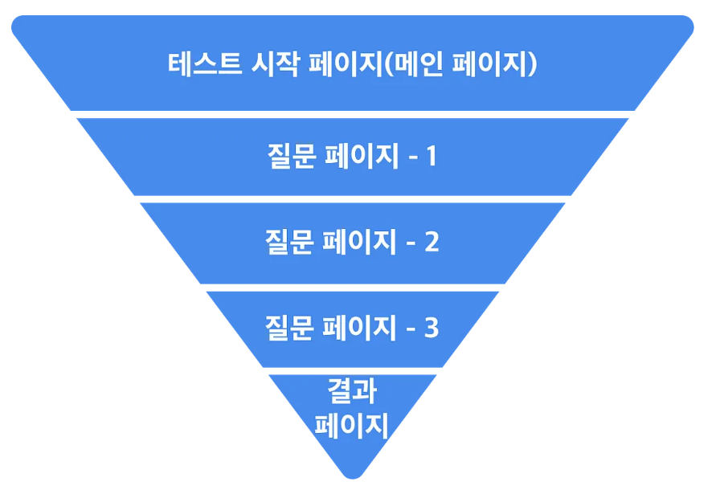
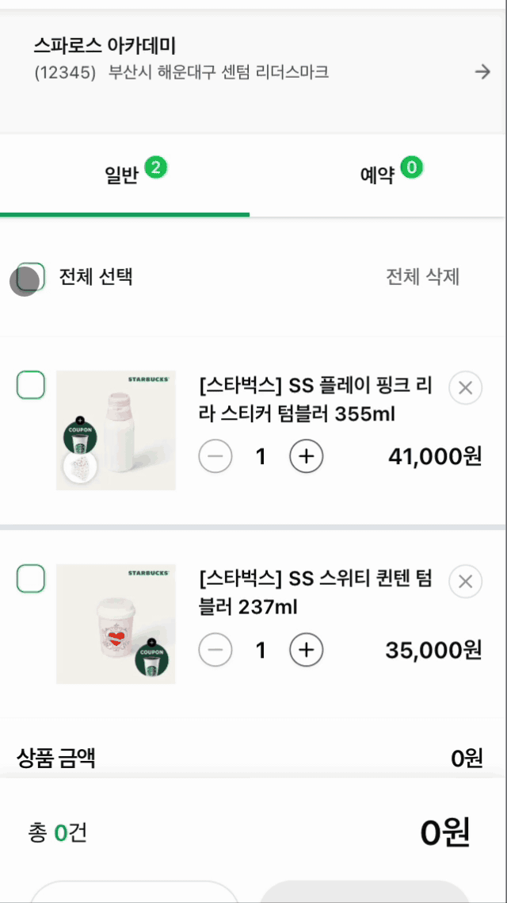
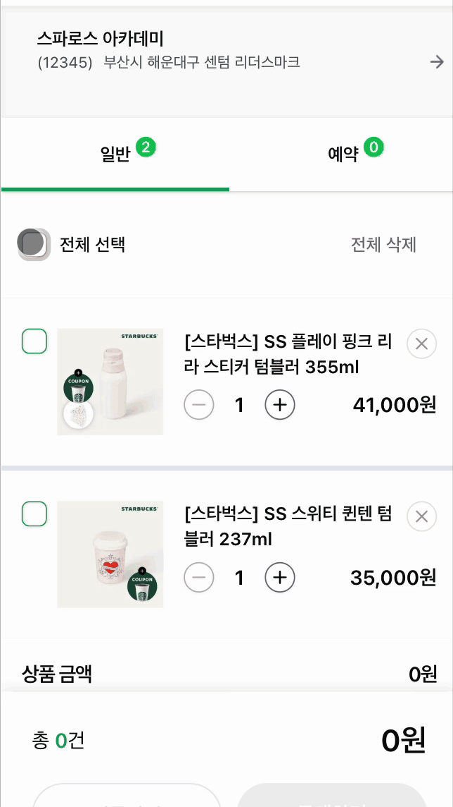
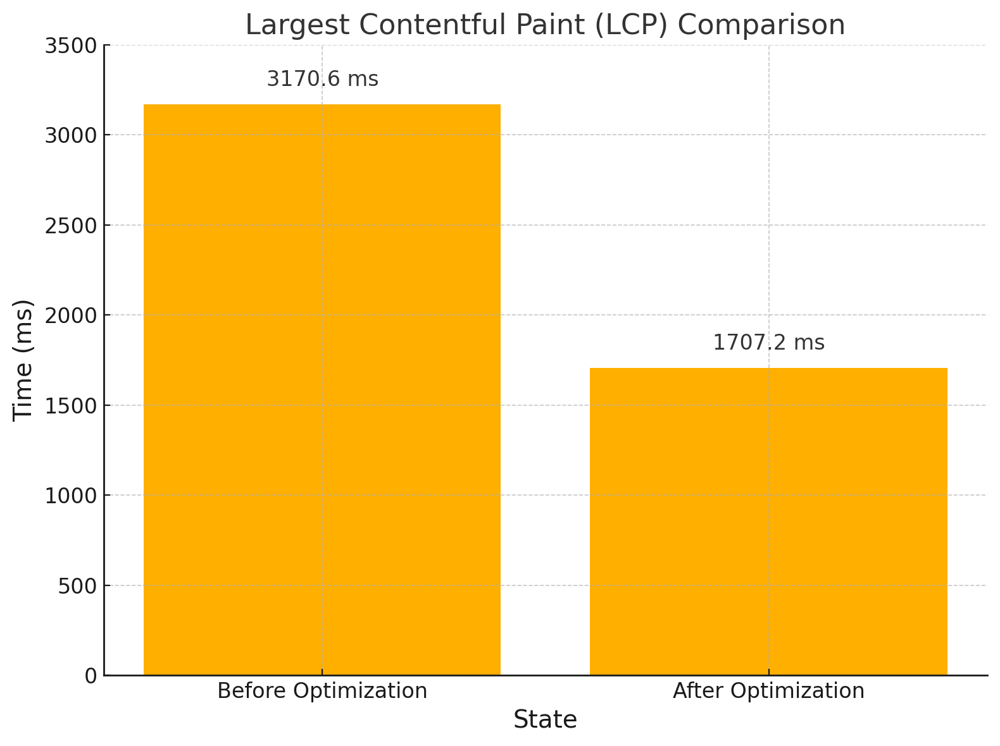
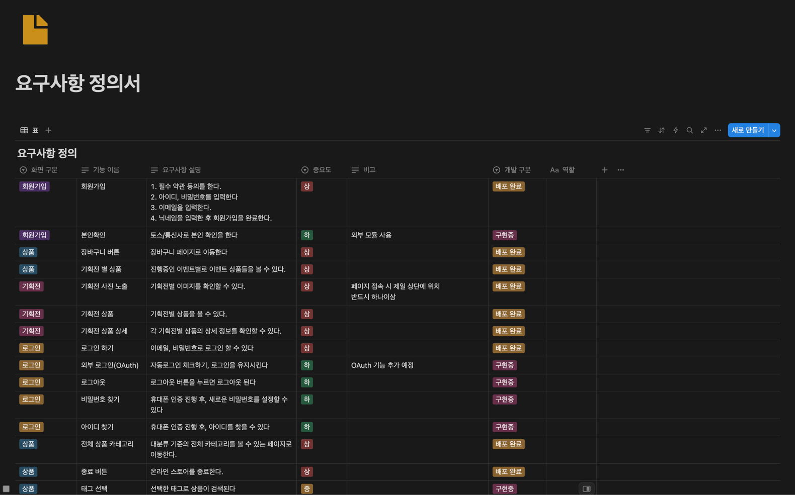
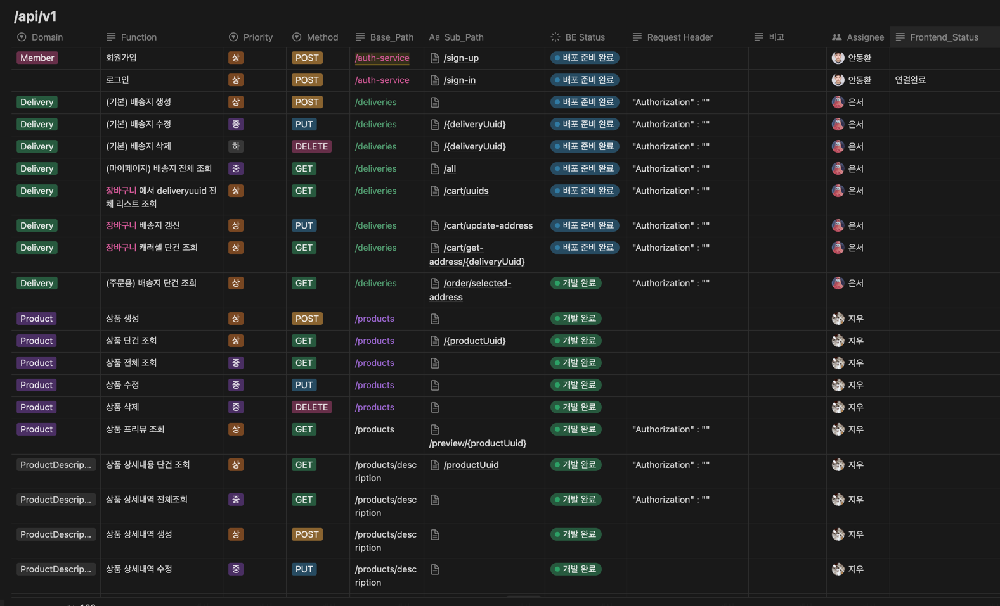

# Team 114


> ✨ 신세계 I&C [스파로스 6기](https://swedu.spharosacademy.com/spharos_total.html) - 리빌딩 프로젝트
>
> ⏫ 스타벅스 내 Shopping 서비스를 새롭게 구현 및 성능 개선
>
> 📅 개발 기간 : 2025년 3월 10일 ~ 4월 28일
>
> 🌐 홈페이지 : https://www.starbucks-renewal.shop/

## 목차

1. [기획 의도 및 기대 효과](#1-기획-의도-및-기대-효과)
2. [개발 환경](#2-개발-환경)
3. [주요 기능](#3-주요-기능)
4. [기술 소개](#4-기술-소개)  
   4-1. [useFunnel Hook 활용](#4-1-usefunnel-hook-활용)  
   4-2. [Optimistic UI 업데이트를 위한 useOptimistic Hook 활용](#4-2-optimistic-ui-업데이트를-위한-useoptimistic-hook-활용)  
   4-3. [Zustand를 활용한 글로벌 상태 관리](#4-3-zustand를-활용한-글로벌-상태-관리)  
   4-4. [useDebouncedFetch Hook으로 API 요청 최적화](#4-4-usedebouncedfetch-hook으로-api-요청-최적화)  
   4-5. [React 리렌더링 최적화 (useCallback, memo)](#4-5-react-리렌더링-최적화-usecallback-memo)  
   4-6. [Next.js 15 캐시 전략 및 revalidateTag 적용](#4-6-nextjs-15-캐시-전략-및-revalidatetag-적용)
5. [설계 문서](#5-설계-문서)
6. [팀원 소개](#6-팀원-소개)
7. [프로젝트 규칙](#7-프로젝트-규칙)
8. [포팅 매뉴얼](#8-포팅-매뉴얼)

## 1. 기획

[🔝 목차로 돌아가기](#목차)

---

## 2. 개발 환경

### Frontend

| Name         | Version |
| ------------ | ------- |
| Next.js      | 15.2.4  |
| Typescript   | 5.0     |
| react        | 19.0.0  |
| tailwindcss  | 4.0.0   |
| zustand      | 5.0.3   |
| next-auth    | 4.24.11 |
| lucide-react | 0.484.0 |
| zod          | 3.24.2  |
| shadcn       | -       |

### Backend

| Name | Version |
| ---- | ------- |
| -    | -       |
| -    | -       |
| -    | -       |
| -    | -       |
| -    | -       |
| -    | -       |

### Infra

| Name | Version |
| ---- | ------- |
| -    | -       |
| -    | -       |
| -    | -       |
| -    | -       |
| -    | -       |
| -    | -       |

### CI/CD

| Name | Version |
| ---- | ------- |
| -    | -       |
| -    | -       |

[🔝 목차로 돌아가기](#목차)

---

## 3. 주요 기능

[🔝 목차로 돌아가기](#목차)

---

## 4. 기술 소개

### 4-1. useFunnel Hook 활용

복잡한 단계별 회원가입 플로우를 효율적으로 관리하기 위해 커스텀 훅인 useFunnel을 도입



#### 📌 useFunnel 도입 이유

1. 단계별 상태 관리 : 다음 단계로 전달
2. 단계 전환 제어 : 사용자가 이전 단계로 돌아가거나 특정 단계로 이동
3. UI 구성의 유연성 : 각 단계에 따라 다른 헤더나 콘텐츠를 렌더링

#### 📋 useFunnel 주요 기능

1. stepIndex를 통해 현재 단계의 인덱스를 관리
2. 폼 데이터 상태 관리: formData를 통해 각 단계에서 입력된 데이터를 유지
3. 입력 처리 함수 제공: onInput을 통해 사용자 입력을 처리하고 상태를 업데이트

#### 🚀 기대 효과

1. 유지보수 용이성 향상: 단계별 로직이 분리되어 있어 코드의 가독성과 유지보수성이 향상
2. 사용자 경험 개선: 사용자가 각 단계에서 필요한 정보를 명확하게 입력하고, 이전 단계로 쉽게 돌아갈 수 있어 사용자 경험이 향상
3. 확장성 확보: 새로운 단계의 추가나 기존 단계의 수정이 용이하여 플로우의 확장성이 확보

---

### 4-2. Optimistic UI 업데이트를 위한 useOptimistic Hook 활용

React 19 및 Next.js 15 기반으로 개발하였기에 새롭게 추가된 useOptimistic Hook을 활용하여 사용자 경험을 극대화.

- 기존 동작 방식  
  

- hook 동작 방식  
  

> **useOptimistic**
>
> - 비동기 작업 중에도 UI를 즉각적으로 업데이트할 수 있는 React Hook
> - SSR 기반에서도 즉시 결과 확인 가능 (클릭 즉시 반영된 것 같은 경험 제공)

---

### 4-3. Zustand 라이브러리를 활용한 상태 관리

Optimistic UI 적용 과정에서 화면 하단 컴포넌트까지 **동시에 상태 변경**할 필요가 있었고, 이를 위해 글로벌 상태 관리로 **Zustand**를 도입.

> **Zustand 라이브러리 선택 이유**
>
> 1. Server/Client 경계에 구애받지 않는 단순한 API
> 2. Context Provider 없이도 필요한 곳에서 바로 사용 가능
> 3. Next.js 15와 충돌 없이 깔끔히 동작

| 적용 전                              | 적용 후                             |
| ------------------------------------ | ----------------------------------- |
|  |  |

---

### 4-4. useDebouncedFetch Hook 활용

Optimistic UI 적용으로 인해 입력 시마다 서버 액션이 과도하게 발생할 위험이 있었음.  
이를 방지하기 위해 클릭 시 UI는 즉각 반영하고, **서버 요청은 디바운싱(Debouncing)** 처리하는 커스텀 훅을 구현.

#### 📋 useDebouncedFetch 주요 특징

1. 로컬 상태(localState)는 즉시 업데이트하여 빠른 사용자 피드백 제공
2. 서버 요청은 일정 시간(delay) 이후 마지막 입력만 실행
3. 서버 요청 실패 시 로컬 상태 롤백

---

### 4-5. 🛠️ React 리렌더링 최적화

초기에는 최적화 없이 모든 상태 변화에 대해 컴포넌트가 리렌더링되어 퍼포먼스 저하 발생.

> **useCallback과 React.memo 도입**
>
> - useCallback: 콜백 함수 메모이제이션 → 불필요한 함수 인스턴스 생성 방지
> - React.memo: prop 변경 없을 시 컴포넌트 리렌더링 방지

#### 📈 개선 결과

| 지표                           | 최적화 전 (`localhost_2025-04-21_15-58-34.json`) | 최적화 후 (`localhost_3000-20250421T160009.json`) | 변화         |
| :----------------------------- | :----------------------------------------------- | :------------------------------------------------ | :----------- |
| First Contentful Paint (FCP)   | 0.9초 (909.6ms)                                  | 0.9초 (909.2ms)                                   | 거의 동일    |
| Largest Contentful Paint (LCP) | 3.2초 (3170.6ms)                                 | 1.7초 (1707.2ms)                                  | 대폭 개선 ✅ |
| Speed Index                    | 1.4초 (1408ms)                                   | 1.4초 (1363.9ms)                                  | 소폭 개선    |



**LCP가 3.2초 → 1.7초로 약 47% 개선**

---

### 4-6 Next.js 15 캐시 전략 설계 및 적용

`fetch` 요청 시 `next: { tags: [...] }` 옵션을 사용하여 **캐시 단위를 세밀하게 나누고, 필요한 경우에만 캐시를 무효화**

#### 📌 설계 방침

- 각 API 요청에 대해 고유한 tag 설정 (`CartItem:uuid`, `CartUuidsList-cartType`, `Product-uuid`, 등)
- 데이터 변경(POST, PUT, DELETE) 시 정확한 `revalidateTag()` 호출
- 목록 데이터와 단건 데이터는 별도 태그 관리
- 전체 업데이트(일괄 토글, 전체 삭제 등) 시 모든 관련 태그 순회 무효화 처리
- 복잡한 관계를 가지는 데이터(Address 목록 및 상세)도 별도 분리 캐싱

#### 📋 주요 예시

- `CartItem:uuid`  
  → 장바구니 개별 상품 조회 시 사용, 변경 시 해당 상품만 invalidate.

- `CartUuidsList-cartType`  
  → 장바구니 항목 리스트 조회 시 사용, 전체 선택/삭제 후 리스트 무효화.

- `Product-uuid`  
  → 제품 상세 조회 시 캐싱, 제품 수정 시 해당 제품만 invalidate.

- `cart:address-uuids-list`, `cart:address-detail uuid`  
  → 배송지 리스트 및 상세 데이터 관리.

#### 🚀 기대 효과

- 필요한 데이터만 갱신하여 **불필요한 API 호출 최소화**
- 빠른 사용자 경험 유지 (필요한 부분만 리렌더링)
- 네트워크 트래픽 및 서버 부하 절감
- 복잡한 상태 변화에도 **캐시 동기화 정확도** 유지

[🔝 목차로 돌아가기](#목차)

---

## 5. 설계 문서

### 시스템 아키텍쳐


### ERD


### 요구사항 정의서



### API명세서



[🔝 목차로 돌아가기](#목차)

---

## 6. 팀원 소개

<table>
  <tr>
    <td align="center"><a href="https://github.com/Demopeu">김동현</a></td>
    <td align="center"><a href="https://github.com/DoNalD-A">👑 송민석</a></td>
    <td align="center"><a href="https://github.com/Ahn-donghwan">안동환</a></td>
    <td align="center"><a href="https://github.com/EUNSEO-YA">오은서</a></td>
    <td align="center"><a href="https://github.com/chuman0216">추지우</a></td>
  </tr>

  <tr>
    <td align="center"><div class="role-box frontend">🖥️ Frontend</div></td>
    <td align="center"><div class="role-box backend">⚙️ Backend</div></td>
    <td align="center"><div class="role-box backend">⚙️ Backend</div></td>
    <td align="center"><div class="role-box backend">⚙️ Backend</div></td>
    <td align="center"><div class="role-box devops">☁️ DevOps</div></td>
  </tr>

  <tr>
    <td align="center">
      메인 페이지<br>
      상품 상세페이지<br>
      장바구니 페이지
    </td>
    <td align="center">
      상품 카테고리<br>
      이벤트(기획전)<br>
      QueryDSL
    </td>
    <td align="center">
      로그인/회원가입<br>
      JWT, Security<br>
      장바구니
    </td>
    <td align="center">
      회원 배송지<br>
      상품 상세 옵션<br>
      데이터 전처리/삽입
    </td>
    <td align="center">
      상품 기능<br>
      상품 이미지 관리<br>
      CI/CD
    </td>
  </tr>
</table>

[🔝 목차로 돌아가기](#목차)

---

## 7. 프로젝트 규칙

### 1. 커밋 메시지 구조

커밋 메시지는 제목, 본문, 그리고 꼬리말로 구성됩니다.
[<스코프>]<타입>: <제목>

<본문>

<꼬리말>

#### _스코프(Scope)_

변경 사항의 범위를 나타냅니다. 예를 들어, 특정 모듈이나 기능의 이름을 사용할 수 있습니다.

- 예: auth, payment, ui, backend

#### _타입(Type)_

타입의 첫글자는 대문자로 작성합니다.

- _feat_: 새로운 기능 추가
- _fix_: 버그 수정
- _docs_: 문서 변경
- _style_: 코드 포맷팅, 세미콜론 누락 등 비즈니스 로직에 영향을 주지 않는 변경
- _remove_: 파일 삭제
- _refactor_: 코드 리팩토링, 기능 변경 없이 코드 개선
- _test_: 테스트 추가, 수정
- _chore_: 빌드 과정 또는 보조 도구 수정, 패키지 매니저 설정 등
- _perf_: 성능 향상 관련 변경
- _ci_: CI 구성 파일 및 스크립트 변경
- _wip_: 작업 진행 중 임시 저장

#### _제목(Subject)_

제목은 변경 사항을 간략하게 설명합니다. 첫 글자는 대문자로 작성하고, 명령문 형식으로 작성합니다.

- 50자를 넘지 않도록 하며, 마지막에 마침표를 찍지 않습니다.
- 예: [auth]feat: Add JWT authentication

#### _본문(Body)_

본문은 변경 사항의 이유와 주요 내용을 설명합니다. 필요 시 다음과 같은 규칙을 따릅니다:

- 한 줄에 72자를 넘지 않도록 합니다.
- "어떻게" 보다는 "무엇을", "왜" 변경했는지 설명합니다.
- 예:
  - Add JWT authentication to secure API endpoints
  - Update login method to issue JWT tokens
  - Modify user model to store JWT refresh tokens

---

### 2. Git 브랜치 작성 컨벤션

#### _브랜치 타입_

브랜치 타입을 명확히 구분하여 브랜치 이름을 작성합니다:

- _feature_: 새로운 기능 개발
- _bugfix_: 버그 수정
- _hotfix_: 긴급 수정
- _release_: 릴리스 준비
- _refactor_: 코드 리팩토링
- _test_: 테스트 관련 작업
- _chore_: 기타 잡무
- _wip_: 작업 진행 중 임시 저장

#### _브랜치 네이밍 규칙_

브랜치 이름은 <타입>/<설명> 형식을 따릅니다. 이슈 번호는 관련된 이슈 트래커의 번호를 사용하고, 설명은 변경 사항을 간략하게 나타냅니다.

- _feature_ 브랜치: 새로운 기능 추가
  - 예: feature/login-main
  - feature의 main branch는 -main을 작성합니다.
  - feature의 하위 branch는 다음과 같이 작성합니다. (feature/login/create)
- _bugfix_ 브랜치: 버그 수정
  - 예: bugfix/fix-login-error
- _hotfix_ 브랜치: 긴급 수정
  - 예: hotfix/critical-bug-fix
- _release_ 브랜치: 릴리스 준비
  - 예: release/1.0.0
- _refactor_ 브랜치: 코드 리팩토링
  - 예: refactor/optimize-auth-module
- _test_ 브랜치: 테스트 관련 작업
  - 예: test/add-unit-tests
- _chore_ 브랜치: 기타 잡무
  - 예: chore/update-dependencies

---

### 3. 브랜치 관리

- _main_: 항상 배포 가능한 상태를 유지합니다.
- _develop_: 다음 릴리스에 포함될 기능이 합쳐지는 브랜치입니다.

[🔝 목차로 돌아가기](#목차)

---

## 8. 포팅 메뉴얼

이 프로젝트는 [Next.js](https://nextjs.org) 프로젝트입니다.

### Getting Started

먼저, 개발 서버를 실행합니다:

```bash
npm run dev
# or
yarn dev
# or
pnpm dev
# or
bun dev
```

브라우저에서 [http://localhost:3000](http://localhost:3000) 을 열어 결과를 확인하세요.

페이지는 app/page.tsx 파일을 수정하여 편집을 시작할 수 있습니다. 파일을 수정하면 페이지가 자동으로 업데이트됩니다.

이 프로젝트는 [`next/font`](https://nextjs.org/docs/app/building-your-application/optimizing/fonts) 를 사용하여 [Geist](https://vercel.com/font)라는 새로운 글꼴을 자동으로 최적화하고 로드합니다.

### Learn More

Next.js에 대해 더 알아보려면 다음 리소스를 참고하세요:

- [Next.js Documentation](https://nextjs.org/docs) - Next.js 기능 및 API에 대해 배우기
- [Learn Next.js](https://nextjs.org/learn) - 대화형 Next.js 튜토리얼

[the Next.js GitHub repository](https://github.com/vercel/next.js)도 확인해보세요. 여러분의 피드백과 기여를 환영합니다!

[🔝 목차로 돌아가기](#목차)
